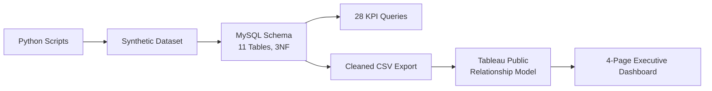
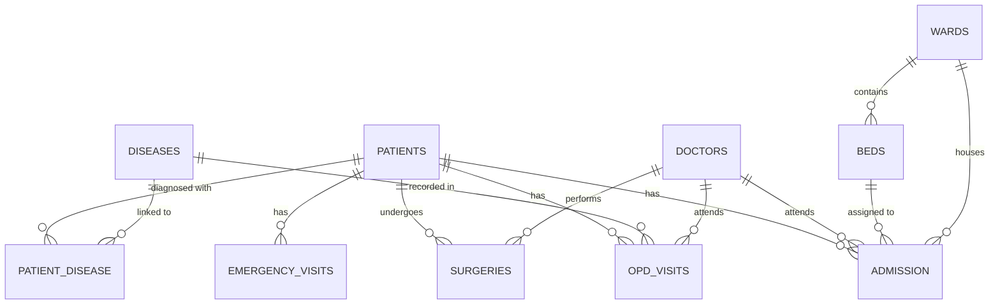
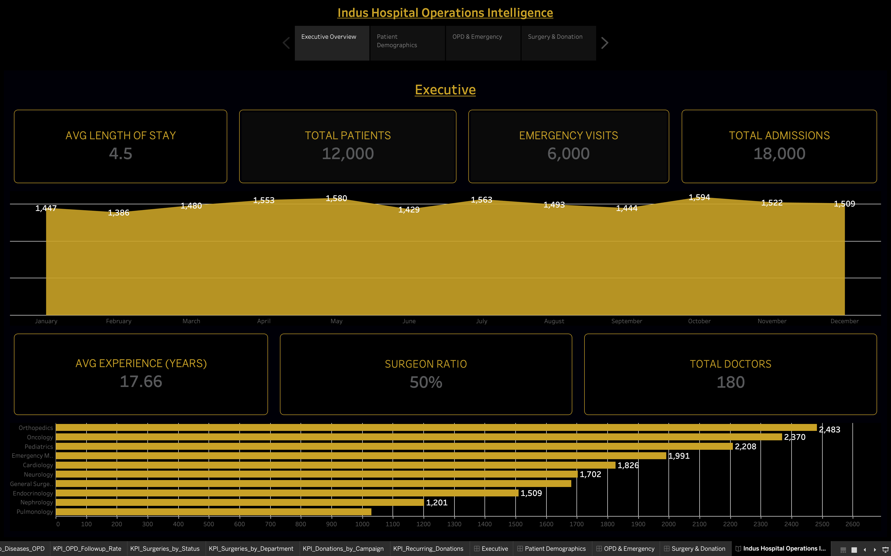
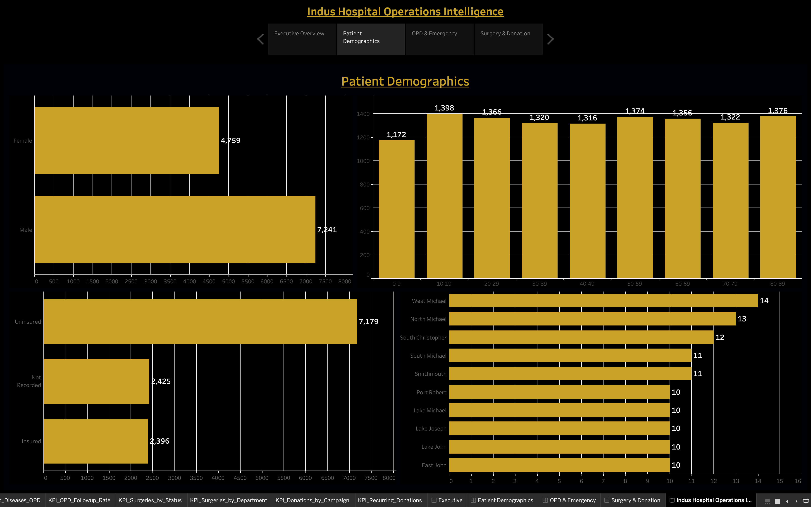
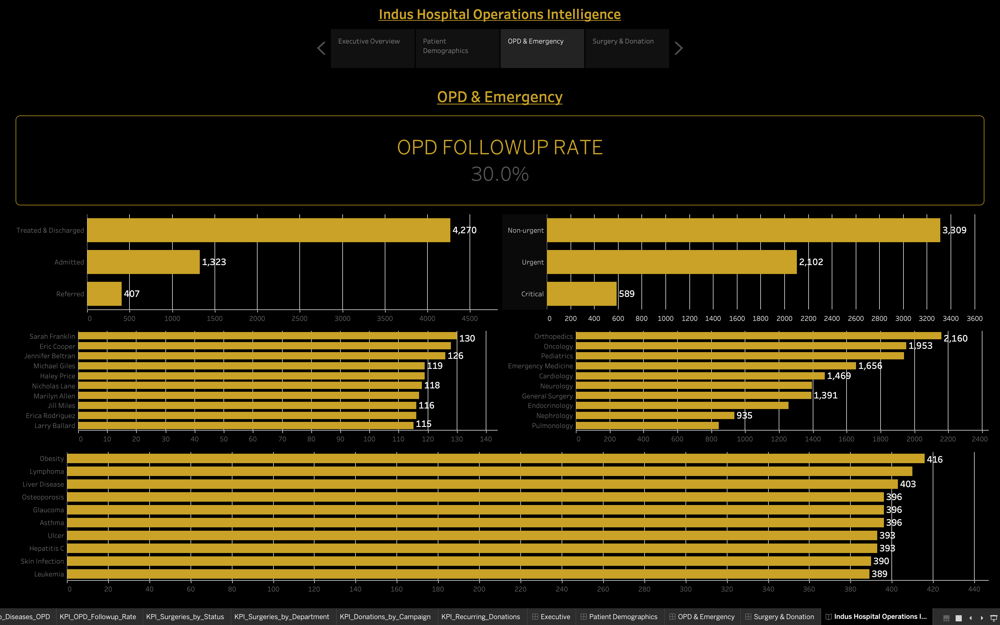
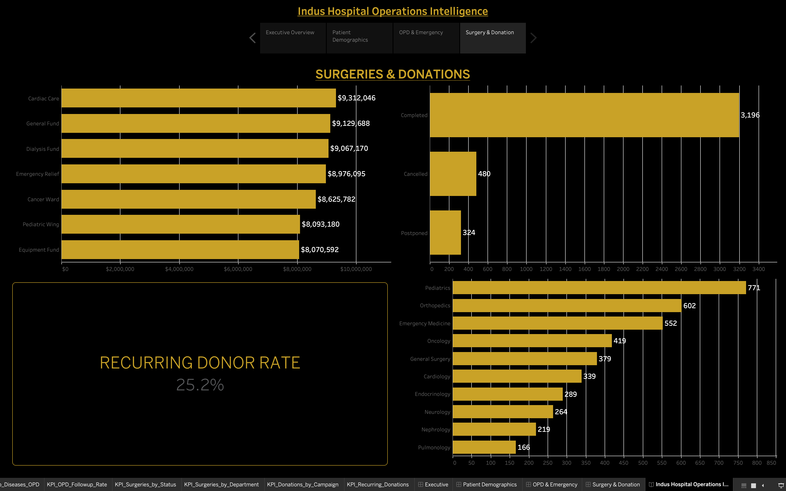

# 🏥 Indus Hospital Operations Intelligence Database

> **My first internship project** — a relational healthcare database, 28 SQL KPI queries, and a 4-page executive Tableau dashboard, built during a 40-hour IT internship at Indus Hospital.


---

## 🧰 Tools Used

<p>
  
  
  
  
  
  
</p>

| Tool | What it was used for |
|---|---|
| 🐍 **Python** (VS Code) | Generated the synthetic dataset — `generate_core.py`, `generate_emergency.py`, `generate_opd.py`, `generate_surgeries.py` |
| 🗄️ **MySQL** | Schema design, normalization (3NF), and the 28 KPI analytical queries |
| 📤 **CSV** | Export/import bridge — cleaned MySQL data exported to CSV, then imported into Tableau Public |
| 📊 **Tableau Public** | Built the 4-page relational dashboard (no live MySQL connection, CSV-only) |
| 🌐 **Git & GitHub** | Version control and portfolio hosting |

---

## 🌟 Overview

This project models hospital operations end-to-end: a normalized **MySQL schema** (11 tables), **28 KPI queries**, and a **4-page Tableau dashboard** covering executive metrics, patient demographics, OPD/emergency activity, and surgeries/donations.

> **Note:** All data is synthetic, generated with Python for this project. No real patient records or hospital data were used.

This was my **first internship** — my first time taking a project from raw schema design all the way through to a polished, presentable dashboard.

---

## 📊 Project Snapshot

| Metric | Value |
|---|---:|
| Tables | 11 |
| Total Patients | 12,000 |
| Total Admissions | 18,000 |
| Emergency Visits | 6,000 |
| Total Doctors | 180 |
| KPI Queries | 28 |
| Dashboard Pages | 4 |
| Avg. Length of Stay | 4.5 days |

---

## 🏗 Architecture



The Tableau data source was rebuilt in small batches (2–3 tables at a time) after early attempts to relate all 11 tables at once caused repeated crashes — tracked down to two tables that had been set up as Unions instead of Relates.

---

## 📐 Database Schema (ERD)



**Tables:** `patients`, `admission`, `doctors`, `wards`, `beds`, `emergency_visits`, `opd_visits` (enriched with disease name), `patient_disease`, `diseases`, `surgeries`, `donations`

`donations` has no shared key with the rest of the schema and is kept as an independent Tableau data source rather than joined into the main model.

---

## 📈 Dashboard Pages

### 🏥 1. Executive Overview
Total Patients (12,000), Total Admissions (18,000), Emergency Visits (6,000), Total Doctors (180), Avg. Length of Stay (4.5 days), Avg. Doctor Experience (17.66 yrs), Surgeon Ratio (50%), monthly admission trend, and admissions by department (Orthopedics leads at 2,483).



### 👥 2. Patient Demographics
Gender split (7,241 Male / 4,759 Female), age group distribution, insurance status (7,179 Uninsured / 2,396 Insured / 2,425 Not Recorded), and geographic distribution by city.



### 🚑 3. OPD & Emergency
OPD Follow-up Rate (30.0%), visit outcomes (4,270 Treated & Discharged, 1,323 Admitted, 407 Referred), emergency triage levels (Non-urgent 3,309 / Urgent 2,102 / Critical 589), doctor workload, and top diagnosed diseases.



### ❤️ 4. Surgeries & Donations
Surgery status (3,196 Completed, 480 Cancelled, 324 Postponed) and department breakdown (Pediatrics leads at 771), alongside donation totals by campaign (Cardiac Care tops at $9.3M) and a 25.2% Recurring Donor Rate.



---

## 📁 Repository Structure

```
Indus-Hospital-Operations-Intelligence-Database/
├── README.md
├── .gitignore
├── Ammar_Indus_Hospital_Proposal.pdf
├── indus_hospital.sql          <- schema + KPI queries
├── generate_core.py            <- patients, doctors, admissions, wards, beds
├── generate_emergency.py       <- emergency_visits
├── generate_opd.py             <- opd_visits, diseases, patient_disease
├── generate_surgeries.py       <- surgeries, donations
├── data/
│   ├── raw/                    <- original synthetic CSVs
│   └── tableau/                <- cleaned CSVs exported for Tableau
└── docs/
    └── screenshots/
        ├── Executive_Overview.png
        ├── Patient_Demographics.png
        ├── OPD_Emergency.png
        └── Surgery_Donation.png
```

---

## ⚡ Setup

```bash
git clone https://github.com/m2ammar/Indus-Hospital-Operations-Intelligence-Database.git
cd Indus-Hospital-Operations-Intelligence-Database

# 1. Generate the synthetic dataset
python generate_core.py
python generate_emergency.py
python generate_opd.py
python generate_surgeries.py

# 2. Build the schema and load data
mysql -u root -p < indus_hospital.sql

# 3. Open the dashboard
# Import the cleaned CSVs from data/tableau/ into Tableau Public
# and open the workbook to explore the 4-page dashboard
```

---

## 🔒 Data Note

All patient, doctor, admission, and billing-adjacent data in this repository is **synthetically generated** for the purposes of this project. It does not represent, and was not derived from, real Indus Hospital patient records or operational data.

---

## 🧠 What I Learned

This being my first internship, this project was also my first time taking something from a blank schema to a full, presentable deliverable:

- Designing a normalized (3NF) relational schema for a multi-entity healthcare domain
- Generating realistic synthetic data programmatically with Python
- Writing analytical SQL with CTEs and window functions for operational KPIs
- Debugging Tableau relationship-model crashes by isolating scale vs. structural issues
- Structuring a federated Tableau data source (related tables + an independent standalone source for donations)
- Taking a project end-to-end: data → database → analysis → dashboard → documentation

---

## 👤 Author

**Muhammad Ammar Saleem**
🎓 BSCS – Data Science, Karachi School of Business & Leadership (KSBL)
🐙 GitHub: [m2ammar](https://github.com/m2ammar)

---

<div align="center">

**Python • MySQL • SQL Analytics • Tableau**

</div>
