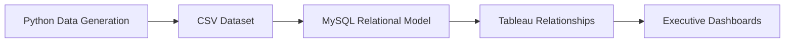

# 🏥 Hospital Analytics Dashboard

> **Executive Healthcare Intelligence using Python, MySQL & Tableau**


---

## 🌟 Overview

This portfolio project demonstrates the complete lifecycle of a healthcare analytics solution—from **synthetic data generation in Python**, to **relational modeling in MySQL**, and finally to a **4-page executive Tableau dashboard**.

> **Note:** This project uses a synthetic dataset modeled on hospital operations. No real patient information is included.

---

# 📊 Project Snapshot

| Metric | Value |
|---|---:|
| Patients | 12,000 |
| Admissions | 18,000 |
| Emergency Visits | 6,000 |
| Doctors | 180 |
| Dashboards | 4 |
| KPIs | 28 |
| Tables | 11 |

---

# 🧰 Tech Stack

- 🐍 Python — synthetic healthcare data generation
- 🗄️ MySQL — schema design and relational modeling
- 📊 Tableau Public — dashboard development
- 🌐 Git & GitHub — version control and portfolio hosting

---

# 🧱 Architecture

```
Python
   │
   ▼
Synthetic Dataset
   │
   ▼
CSV Files
   │
   ▼
MySQL Schema
   │
   ▼
Tableau Relationships
   │
   ▼
Executive Dashboard
```



---

# 📂 Dataset

- patients.csv
- admission.csv
- doctors.csv
- beds.csv
- wards.csv
- diseases.csv
- patient_disease.csv
- emergency_visits.csv
- opd_visits_enriched.csv
- surgeries.csv
- donations.csv

---

# 📈 Dashboard Pages

## 🏥 Executive Overview

**Purpose:** High-level operational KPIs for executives.

Highlights:
- Total Admissions
- Total Patients
- Emergency Visits
- Average Length of Stay
- Total Doctors
- Surgeon Ratio
- Monthly Admission Trend
- Admissions by Department

_Add your Executive_Overview.png here._

## 👥 Patient Demographics

Business questions answered:
- Gender distribution
- Age groups
- Insurance status
- Geographic distribution

_Add your Patient_Demographics.png here._

## 🚑 OPD & Emergency

Insights:
- Emergency outcomes
- Triage levels
- Doctor workload
- OPD department performance
- Top diseases

_Add your OPD_&_Emergency.png here._

## ❤️ Surgery & Donation

Insights:
- Donations by campaign
- Surgery status
- Department surgeries
- Recurring donor rate

_Add your Surgery_&_Donation.png here._

---

# ✨ Features

- ✅ Synthetic healthcare dataset
- ✅ Relational data model
- ✅ Interactive Tableau dashboards
- ✅ Executive KPI cards
- ✅ Department analytics
- ✅ OPD & Emergency insights
- ✅ Donation analytics
- ✅ Portfolio-ready documentation

---

# 🧠 Key Learnings

- Designing normalized healthcare datasets
- Building executive dashboards
- Creating Tableau calculated fields
- Visual storytelling with KPIs
- Data modeling using MySQL

---

# 🚀 Repository Structure

```
Hospital-Analytics/
├── assets/
├── data/
├── python/
├── sql/
├── tableau/
├── docs/
└── README.md
```

---

# 📜 License

MIT License

---

<div align="center">

### Built by Muhammad Ammar Saleem

**Python • MySQL • Tableau • Data Analytics**

</div>
